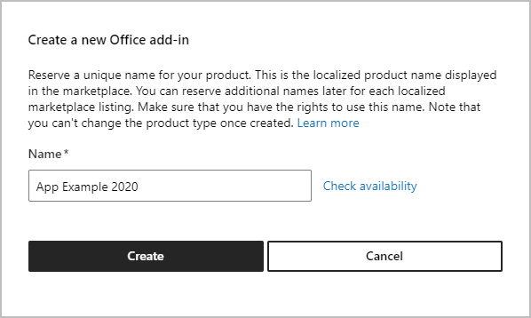
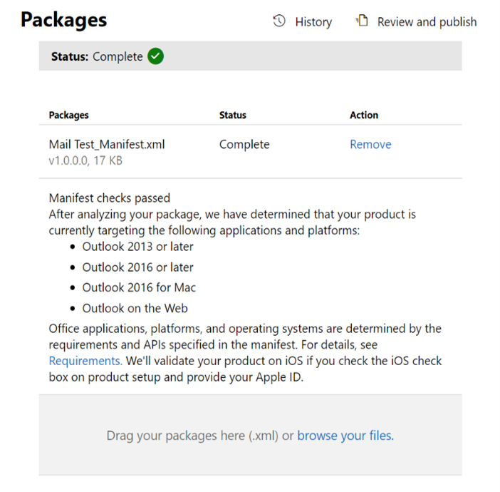
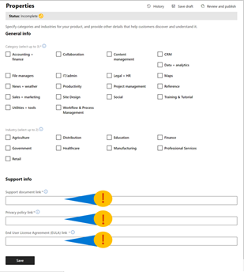
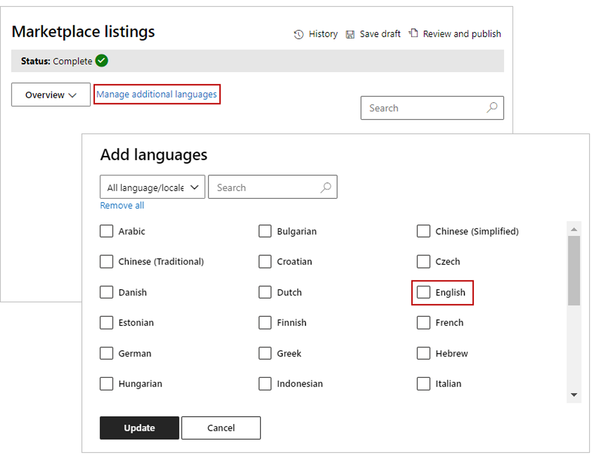
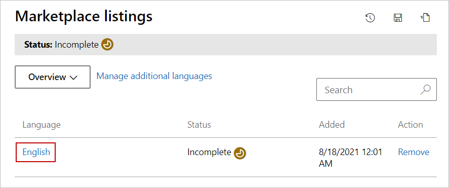
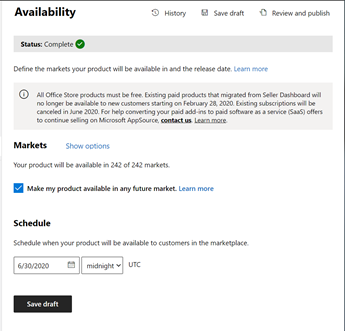

# Store submission guide

Before submitting your add-in, we recommend you watch this quick 5 min video on how to submit for review in Partner Center.

## Step 1: Select the type of add-in you are submitting 

From the Overview tab in the Microsoft Partner Center, select Create a new and select the Office add-in option.

 
## Step 2: Name your app
 
You’ll be prompted to enter a name for your add-in.

## Step 3: Tell us about your Product Setup 
- **Will your add-in be listed in the Apple Store?** If so, include your Apple ID.
- **Does your add-in use Azure Active Directory or SSO (AAD/SSO)?** If so, select the box that asks about this.
- **Does your add-in require additional purchases?** If so, select the box that asks about this. 
- **Do you want to connect with your lead management CRM system?** If so, connect this system using the Connect link.

## Step 4: Upload your manifest for package testing
Remember to pre-test your package to prevent any unexpected failures in this step.

Get information on all [the pre-testing manifest tools](https://docs.microsoft.com/office/dev/add-ins/testing/troubleshoot-manifest#:~:text=%20To%20use%20a%20command-line%20XML%20schema%20validation,and%20replace%20XML_FILE%20with%20the%20path...%20More%20).

## Step 5: Define the metadata that will categorize your add-in in the store

Don’t forget critical URL links to support policies, privacy policies, and End User License Agreements.

## Step 6: Define your languages in Marketplace Listings

This step can be confusing. Click on manage additional languages to begin. Then pick the language your add-in will be in to create a store entry.

## Step 7: For each language your add-in is available in, create your detailed store listing copy, icons, videos and screenshots

Within the language option, you'll find where you can fill in your add-in's store listing information, such as your add-in description and images.

## Step 8: Set your availability date and time for when you want your add-in listing to appear

Note it typically takes 4 to 6 weeks to complete an app submission and get it approved. On average, most add-ins require multiple submissions to pass our validation process, so follow our checklist carefully to reduce this time.  

## Step 9:  Make sure you add your critical testing instructions

This final critical step requires you include notes for certification, This is any critical instructions for the reviewer who will be testing your add-in, including test accounts, license keys and testing credentials.

If you checked the box stating you require additional purchases, make sure you provide any information such as license keys that a review might need to evaluate your add-in.

>[!TIP]
> Do not include an email address of a company employee who can provide log-in information. Our reviewers will be able to  email you for log-in information. Applications that include an email instead of certification notes will fail the submission process automatically.

The following image shows the Notes for certification box where you must provide information.

## Step 10:  Use the following checklist to avoid the top 5 common errors that produce 80% of review rejections 

- Did you include Terms of Use links? (link to prep checklist)
- Did you include Privacy Policy links? (link to prep checklist)
- Did you including Testing instructions for the Reviewer? (link to prep checklist)
- Did you indicate Service or Account disclosures? (link to prep checklist)
- Did you indicate any Additional Charge Disclosures for required paid services? (link to prep checklist) 

If you answered yes to all of the above, hit the submit button on your app for review and approval.

Congratulations, you are done submitting.

You can expect a response within 3 to 4 business days from our reviewers if there are any issues related to your submission.