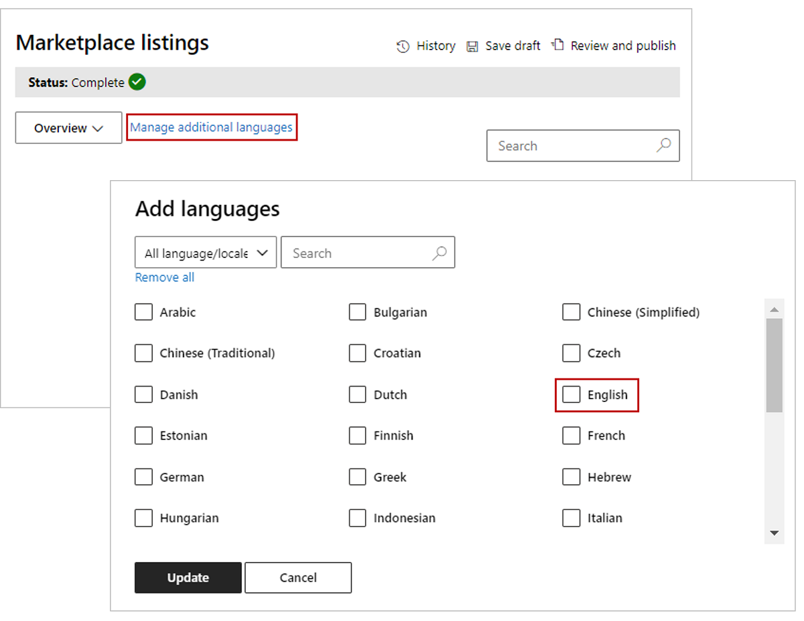

# Store submission guide

This article is a step-by-step guide that will detail how to submit your app to the Microsoft stores.

>[!TIP]
>We recommend reading our [pre-submission checklist](./checklist.md) before reading this store submission guide, so you have all information ready to go for submission.

## Step 1: Select the type of app you are submitting

For this guide, we will create an Office Add-in as our app. From the Overview tab in the Microsoft Partner Center, select **Create a new** and select the Office Add-in option.

## Step 2: Name your app

You’ll be prompted to enter a name for your app.

## Step 3: Tell us about your Product Setup

- **Will your add-in be listed in the Apple Store?** 
    If so, include your Apple ID.
- **Does your add-in use Azure Active Directory or SSO (AAD/SSO)?** 
    If so, select the box that asks about this.
- **Does your add-in require additional purchases?** 
    If so, select the box that asks about this. 
- **Do you want to connect with your lead management CRM system?** 
    If so, connect this system using the Connect link.

## Step 4: Upload your manifest for package testing

Remember to pre-test your package to prevent any unexpected failures in this step.

Get information on all [the pre-testing manifest tools](https://docs.microsoft.com/office/dev/add-ins/testing/troubleshoot-manifest#:~:text=%20To%20use%20a%20command-line%20XML%20schema%20validation,and%20replace%20XML_FILE%20with%20the%20path...%20More%20).

## Step 5: Define the metadata that will categorize your app in the store

Don’t forget critical URL links to support policies, privacy policies, and End User License Agreements. For more information on what your policies should look like, see [our submission checklist](checklist.md###Step-5-:-If-your-add-in-requires-additional-purchases-from-thir-party-services-or-SaaS-offers-,-provide-testing-information-for-these-services).

## Step 6: Define your languages in Marketplace Listings

This step can be confusing. Click on manage additional languages to begin. Then pick the language your app will be in to create a store entry.

## Step 7: For each language your app is available in, create your detailed store listing

Your store listing should include copy, icons, videos, and screenshots. For details, see [our submission checklist](./checklist.md###Step-7-:-Prepare-your-store-listing-with-your-team).

Within the language option, you'll find where you can fill in your app's store listing information, such as your app description and images.

## Step 8: Decide on your availability date

You can schedule when your app will be available. Note it typically takes 4 to 6 weeks to complete an app submission and get it approved. On average, most apps require multiple submissions to pass our validation process, so follow our checklist carefully to reduce this time.  

## Step 9:  Make sure you add your critical testing instructions

This final critical step requires you include notes for certification, This is any critical instructions for the reviewer who will be testing your app, including test accounts, license keys and testing credentials.

If you checked the box stating you require additional purchases, make sure you provide any information such as license keys that a review might need to evaluate your app.

>[!TIP]
> Do not include an email address of a company employee who can provide log-in information. Our reviewers will **not be able to email you for log-in information**. Applications that do not list clear instructions in the certification notes will fail the submission process automatically.

The following image shows the Notes for certification box where you must provide information.

## Step 10:  Use the following checklist to avoid the top 5 common errors that produce 80% of review rejections

You can use our **[pre-submission checklist](./checklist.md)** to address all the things on this list.

- Did you include Terms of Use links?
- Did you include Privacy Policy links?
- Did you including Testing instructions for the Reviewer?
- Did you indicate Service or Account disclosures?
- Did you indicate any Additional Charge Disclosures for required paid services?

Once you have answered those questions for yourself, hit the submit button on your app for review and approval.

## Step 11: Congratulations, you are done submitting!

You can expect a response within 3 to 4 business days from our reviewers if there are any issues related to your submission.