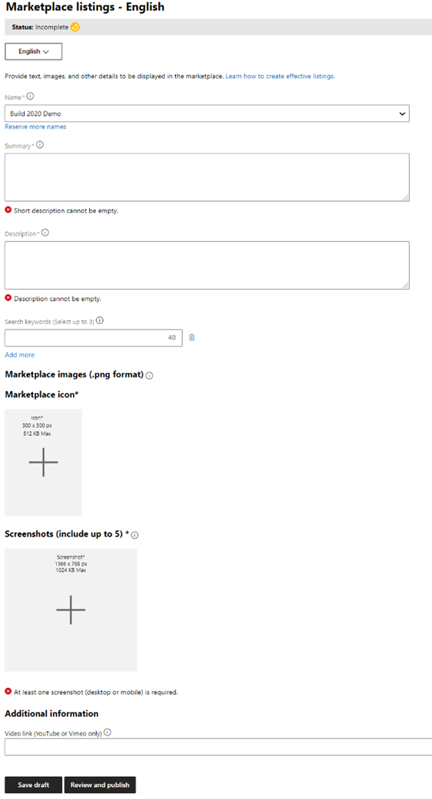

# Am I ready to publish?

Before submitting your Office Add-in for review, make sure it’s ready to be released to customers and that you’re making the most of your add-in description page that customers will see when they download your add-in

## Submission checklist

This is a checklist to help you ensure your submission and review go smoothly.

### Step 1: Determine your launch timeline

Plan ahead! Submitting your add-in for review can take up to 4 weeks from first submission until final approval.

Make sure include time in your deployment schedule for our team to not only review your add-in, but for changes to be made to your add-in if needed.

>[NOTE!]
> Your validation application may not be approved at first submission. This is common if this is your team’s first time submitting an add-in.

### Step 2: Review all the Microsoft Office add-in policies

Make sure you read through our policy document, especially any areas associated with Office products your add-in is targeting.

- Read the general policies here [LINK]
- Follow the specific policies about Office 365 or Office Add-ins here including Outlook, Word, Excel, and PowerPoint
- Discover the specific policies about SharePoint Add-ins or SharePoint Framework (SPFx)

### Step 3: Check that your manifest is compliant

There are several tools you can use to self-test your manifest file. These tools use the exact same package validation service we use in our review process. This will help ensure you pass our automated testing before you submit. 

- Find the best tool for self-testing your manifest

### Step 4: Decide what platforms you will  support?

If you are supporting Apple iOS or Android, make sure you have your correct ID information associated with your Partner Center Profile.

For example, for an add-in available on iOS, you will need to have your Apple ID in your Partner Center account settings page.

Note that Outlook is the only Office product that supports Android. Learn how to configure this in Partner Center before you submit here [LINK]

### Step 5: If your add-in requires additional purchases from third party services or SaaS offers, provide testing information for these services

Make sure you have any third party service information ready to include in your submission. In the submission process, you’ll first need to check the 

Additional purchases box, as shown in the following picture. 

Next, you’ll need to provide license keys, sample accounts, test credentials and any other critical instructions to our review team so that the process for getting the in-app purchase can be tested by our review team. This information should go in the Notes for certification box, as shown in the following picture.

[PIC?]

Your test plans and any testing accounts and instructions need to be included here

### Step 6: Include critical information links with https:// addresses 

The addresses for a support URL, a privacy policy URL, and an end user license agreement (EULA) URL  are required. Not including these links is one of the top reasons an add-in submission is rejected by our team. The following image shows the box that asks for the support information.

#### Make sure you provide a link to your support page so that your users can reach you if they have a problem.

Provide a URL for so the customers who have issues with your add-in can contact your company for support.

> [!NOTE]
> This cannot be an email address, it must be an https:// URL.

#### Ensure your company has a privacy policy that includes your add-in
Provide the URL for the privacy policy for your add-in.

The privacy policy you link to must include:
- Information on your policies regarding users’ personal information
- A reference to the add-in OR your service overall, not only your website
- A description of your service that includes the name of the add-in or app you are submitting
- A valid link that does not generate a 404 error

If your privacy policy is missing any of the above, it will fail validation and require re-submission.

>[!NOTE]
> A Terms of Use policy is not considered a privacy policy. You must include a privacy policy that is separate from your Terms of Use policy. 

#### Include an End User License Agreement
Make sure you have an https:// URL for your EULA policy ready when you submit. If you don’t already have one, consult with your legal council about using this one from Microsoft. 

### Step 7: Prepare your store listing with your team

Your final step in preparing for submission is to fill out a marketplace listing that will appear in the store to customers. This listing includes the copy in your listing, your branding, your add-in name and any screenshots and videos you want to use to promote it.

You'll need to provide the correct metadata indicating how you want your app to be listed in the store, including:

- Your app name
- A short description of your add-in and its value.
- A long description of your add-in with HTML formatting. We recommend you use an HTML editor to create your descriptions ahead of time, so that you can preview how it looks before you paste it into the description fields.

>[!NOTE]
> There isn't a preview in submission, so it is important to make sure it looks correct before submitting. Otherwise, you may have to re-submit your app for review again to fix any formatting issues or typos. 

You'll also need to provide: 
- Correct icons that are the right sizes.
- Any screenshots and video demos. Here are tips for how to do that effectively [LINK]. One screen shot is required.  
