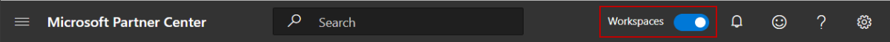
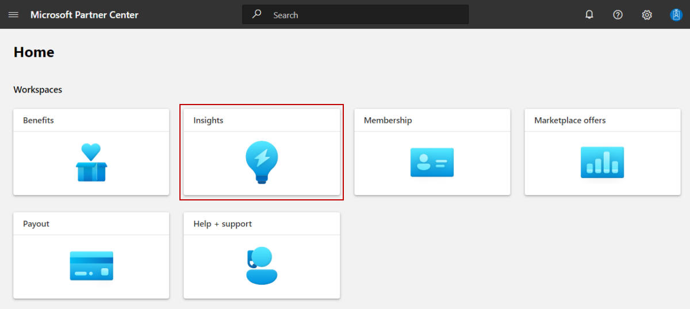
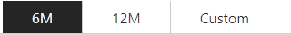
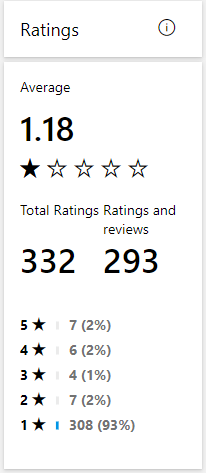
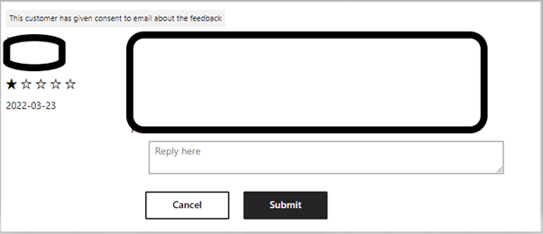
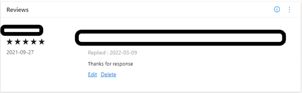

# Ratings and reviews dashboard for office addins analytics

This article provides information on the Ratings and reviews dashboard in Partner Center for Office addins. This dashboard displays a consolidated view of customer feedback for selected office addins application. As customers browse, search, and purchase offers, they can leave ratings and reviews for the offers they've acquired.

- Customers can submit a new rating or review and update or delete an existing rating or review they have submitted. Customers can make changes only to the ratings and reviews they own.
- Reviews are posted on the Reviews tab on the product display page of the offer in AppSource. Customers can include their name or post anonymously.

## Accessing the Ratings & reviews dashboard

1. Sign in to [Partner Center](https://partner.microsoft.com/dashboard/home).
1. If you see the **Workspaces** toggle in the top menu bar, make sure the toggle is set to on.

    

1. Select the **Insights** tile,on the Home Page.

    
     

1. In the left-nav, under **Office addins**, select **Ratings & reviews**.

The dashboard displays a graphical representation of the following customer activity:

- Ratings
- Review comments

Select the offer from the offer dropdown list and the ratings and reviews for that specific offer will be displayed.

## Time period

Near the top of the page, you can select the time frame for which you want to see the Ratings and review. The default selection is 6M (6 months), but you can choose to show data for twelve months or a time duration of your choice.

## Ratings summary

The summary section displays the following metrics for a selected date range:

- **Average rating**: Weighted average star rating of all the ratings submitted by customers for the selected offer.
- **Rating breakdown**: Breakdown of star rating by the count of customers who submitted ratings. The bar chart is stacked with actual and revised ratings (updated rating count).
- **Total ratings**: Overall count of ratings submitted. This count also includes ratings with and without reviews.
- **Ratings with reviews**: Count of reviews submitted.

## Review comments

The default view displays all reviews, and you can filter through the reviews by star rating using the **rating filter** in the dropdown menu.

### Respond to a review

You can respond to reviews from users and the response will be visible on AppSource storefronts. 

To respond to a review, follow these steps:

1.	On the Ratings & reviews page, select offers for which you would like to respond to a review. You can select filters to narrow down the list of reviews, and display, for example, only reviews with a specific star rating.

2.	Select the Reply link for the review you wish to respond, type your reply on the text box, then select Send reply.

3. Once the response to review is posted, the account user can Edit or Delete the response for that review. 

The response will appear under the text of the original review in the product detail page in AppSource online storefront.

## See also

- [View the acquisitions report in the dashboard](view-acquisitions-report.md#acquisitions-chart)
- [View the usage report in the dashboard](view-usage-report.md)
