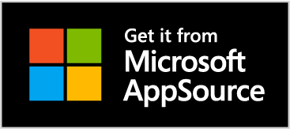

# Promote your AppSource solution

After you submit your solution and it's approved for addition to AppSource, you might want to brand it as an AppSource solution on your webpage. You can use the **Get it from Microsoft AppSource** badge to promote your solution and drive traffic from your site to AppSource. To do so:

1. Download the [AppSource marketing toolkit](https://aka.ms/marketplaceresourcesguide).

2. Download the **Get it from Microsoft AppSource** badge from the toolkit.

    

3. Add the badge to the webpage for your solution. This makes it clear to your users that they can download your solution from AppSource.

## Guidelines for using the AppSource badge

The following guidelines apply to using the **Get it from Microsoft AppSource** badge on your webpage:

- Badges should always appear in full color with white type and a black background as shown. Use only the artwork provided – never create your own badges. Do not modify, recolor, angle, animate, rotate, or tilt the badges. Scaling while maintaining the aspect ratio for appropriate sizing is allowed.
- Ensure badges are legible on all marketing communications in which they're utilized.
- Provide a link to the associated product listing landing page.
- Always use the full name by referencing "Microsoft AppSource".

## Track your campaign performance and customize your add-in for targeted audiences

> [!NOTE]
> Campaign tracking is enabled for all Office 365 listings on AppSource. Currently, activation data is only provided for Word, Excel, and PowerPoint add-ins.

When you link from your promotional campaigns to your free Word, Excel, or PowerPoint add-in page in AppSource, include the following query parameters at the end of the URL:

- **mktcmpid** - Your marketing campaign ID, which can include up to 16 characters (any letter, number, \_, and -). For example, blogpost_12. This value will be used to provide a breakdown in the Acquisitions report.
- **src** - This is an optional parameter that declares the source of the user traffic.

The following example shows a URL that includes the two query parameters:

```
https://appsource.microsoft.com/product/office/WA102957661?src=website&mktcmpid=blogpost_12
```

Adding these parameters to your campaign URL enables us to provide more information about your campaign's user funnel. The [Acquisitions report](https://partner.microsoft.com/dashboard/analytics/office/acquisitions) in the Partner Dashboard will provide you a breakdown of your AppSource campaign results.

The  _mktcmpid_ parameter is passed all the way to the launch document. This allows you to customize the first user experience of your free Word, Excel, or PowerPoint add-in to, for example, display a specific splash screen or welcome message to your targeted audience.

When the document loads for the targeted user, the  _mktcmpid_ parameter is available in the [Settings object](/javascript/api/office/office.settings) of the add-in as a Microsoft.Office.CampaignId, in Office clients where the Settings object is supported. Use the following code to read the Microsoft.Office.CampaignId from the Settings object.

```js
if (Office.context.document.settings) {
    return Office.context.document.settings.get("Microsoft.Office.CampaignId");
}
```

The value that is sent to the document is the value of the  _mktcmpid_ parameter.

## See also
<a name="bk_addresources"> </a>

- [Make your solutions available in AppSource and within Office](submit-to-the-office-store.md)
- [Office Add-ins](https://docs.microsoft.com/en-us/office/dev/add-ins/overview/office-add-ins)  
- [SharePoint Add-ins](https://docs.microsoft.com/en-us/sharepoint/dev/sp-add-ins/sharepoint-add-ins)
