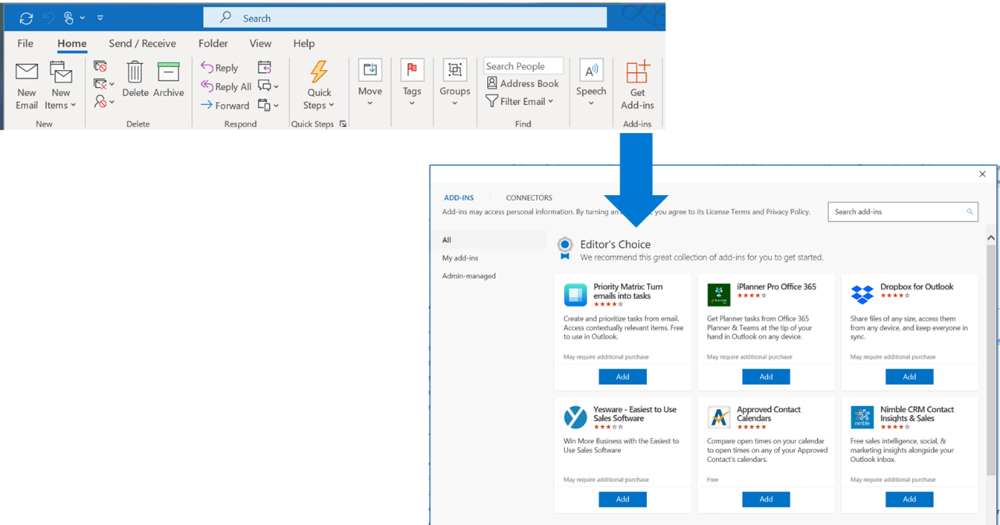
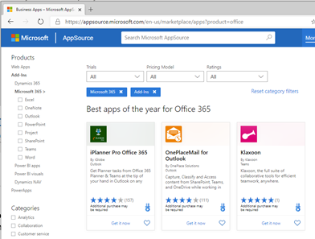

# Why publish your add-in with Microsoft’s app stores

Your app can be distributed directly through the Office app store inside of Outlook, Excel, PowerPoint, and SharePoint, where millions of customers around the world are working everyday. Your app might be featured as an Editor’s Choice add-in, instantly reaching customers.

In addition to the Office store, Microsoft App Source is another distribution point for your add-in. It is  an app store of Microsoft 365 apps and solutions.

## How do I get into both stores?

When you submit your app for validation and it is approved,  your add-in is  automatically added to the appropriate stores depending on the focus of your app or add-in.